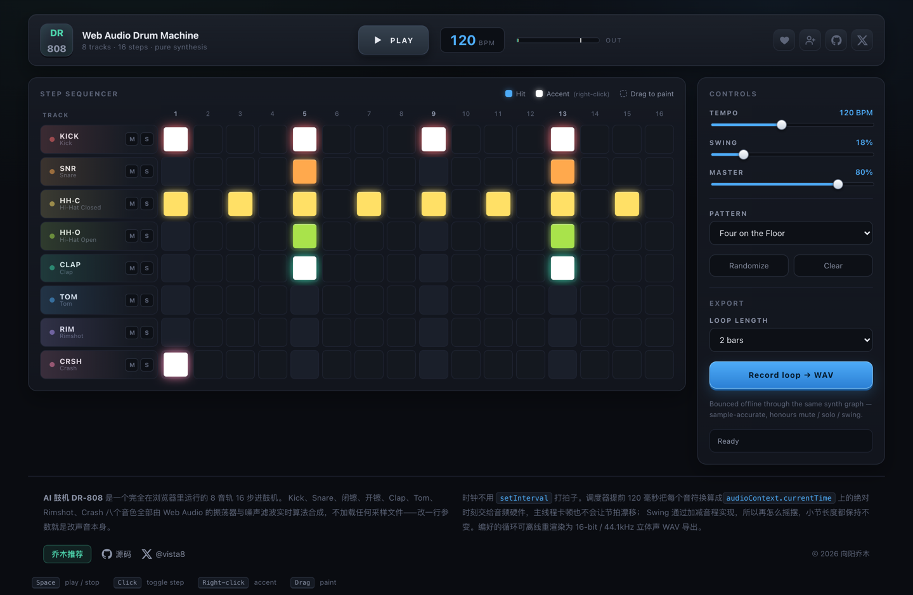
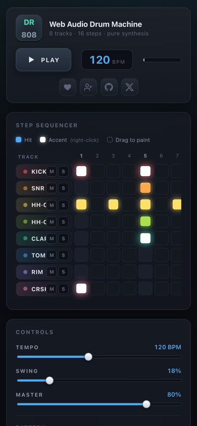

# DR-808 · Web Audio 鼓机

**中文** | [English](#english)



> 一个完全跑在浏览器里的鼓机。8 个音色全部由 Web Audio 振荡器与噪声滤波实时算出来，没有加载任何采样文件。
> A drum machine that runs entirely in the browser. All eight voices are synthesised live from oscillators and filtered noise — not a single sample is loaded.

**[在线试用 → drum.qiaomu.ai](https://drum.qiaomu.ai/)** · [MIT 许可证](LICENSE) · 无需注册、无需后端、无追踪以外的网络请求

**已验证（2026-08-27）**
`npm run verify` 33/33 通过 · 浏览器交互 18/18 · 布局几何 12/12 · 20 秒漂移测试无累积漂移 · 音符落点最大误差 **11.3 微秒**

---

## 这是什么

打开网页就能编鼓的步进音序器（step sequencer）。8 条音轨、16 个步进格，点亮格子就出声，播放头跟着扫，编完一键导出 WAV。

它解决的是一个很具体的痛点：想在浏览器里试一段节奏，通常要么打开一个加载几十兆采样包的在线 DAW，要么装软件。这里没有采样包 —— 底鼓就是一条带音高包络的正弦波，踩镲就是六个方波过一遍高通。改一行参数就是改声音本身。

## 为什么值得用

- **零采样、零依赖音频资源**。整个应用 170 KB JS（gzip 56 KB），首屏不需要下载任何音频文件。
- **节拍不会漂**。调度器提前 120 毫秒把每个音符换算成 `audioContext.currentTime` 上的绝对时刻交给音频硬件，主线程卡死 100 毫秒，节奏也不会动。
- **导出和听到的是同一个东西**。WAV 不是录制的，而是在 `OfflineAudioContext` 里用同一套合成代码重新渲染一遍。
- **离线可用**。装了 PWA 之后断网也能编鼓。

## 核心能力

| 能力 | 用户得到什么 |
| --- | --- |
| 8 音轨 × 16 步进矩阵 | Kick、Snare、闭镲、开镲、Clap、Tom、Rimshot、Crash 各占一行，一列就是一个 16 分音符 |
| 全算法音色合成 | 8 个声音全部由振荡器 + 噪声 + 滤波器实时算出，无采样文件 |
| 提前调度时钟 | 120 ms 前瞻 + Worker 时钟，20 秒实测无累积漂移，落点误差 11.3 µs |
| BPM 60–200 | 改速度不影响已经排好的音符位置 |
| Swing 摇摆 | 只推迟反拍，小节长度严格不变（实测 2.00000s → 2.00000s） |
| 逐轨静音 / 独奏 | 8 ms 斜坡淡入淡出，不会咔哒一声 |
| 主音量 + 母线限幅 | 重音叠满也不会削波，实测峰值 0.9685 |
| 重音（Accent） | 右键点亮，力度 +38%，走的是力度不是音量 |
| 拖拽刷步 | 按住横扫一整片格子 |
| 5 套预设 | Four on the Floor / Boom Bap / Rock / Breakbeat / Trap |
| WAV 导出 | 1/2/4/8/16 小节循环，16-bit / 44.1 kHz 立体声，离线渲染 |

## 样例输出

`npm run verify` 会把每个音色单独渲染一遍再测量。以下是单个重音击打的实测电平：

```text
Kick           peak  -2.9 dBFS   rms -28.9 dBFS
Snare          peak  -7.4 dBFS   rms -41.0 dBFS
Hi-Hat Closed  peak -14.0 dBFS   rms -57.1 dBFS
Hi-Hat Open    peak -15.1 dBFS   rms -48.2 dBFS
Clap           peak -19.0 dBFS   rms -52.5 dBFS
Tom            peak  -5.4 dBFS   rms -31.8 dBFS
Rimshot        peak  -8.3 dBFS   rms -46.2 dBFS
Crash          peak  -6.4 dBFS   rms -31.3 dBFS
```

导出的 2 小节 WAV（120 BPM）：8.0 秒，1.10 MB，RIFF/WAVE 头 `2ch / 44100 Hz / 16-bit`。

## 快速开始

### 最快路径

直接在浏览器打开 **[drum.qiaomu.ai](https://drum.qiaomu.ai/)** —— 不需要安装任何东西。

<details>
<summary>本地运行 / 手动安装</summary>

```bash
git clone https://github.com/joeseesun/web-audio-drum-machine.git
cd web-audio-drum-machine
npm install
npm run dev      # http://localhost:5173
```

生产构建与离线音频断言：

```bash
npm run build    # 输出到 dist/
npm run preview  # 预览生产构建
npm run verify   # 离线渲染 + 音频断言（依赖 node-web-audio-api）
```

部署是纯静态的：`npm run build` 之后把 `dist/` 丢到任意静态服务器即可，注意 SPA fallback 要指回 `index.html`。

</details>

## 使用方式

| 操作 | 效果 |
| --- | --- |
| 点击格子 | 点亮 / 熄灭音符（未播放时会试听一下） |
| 按住横扫 | 连续刷亮一整片 |
| 右键格子 | 切换重音（更亮、更响） |
| 空格 | 播放 / 停止 |
| 点音轨名 | 单独试听该音色 |
| M / S | 该轨静音 / 独奏 |

浏览器出于自动播放策略要求先有一次用户交互，所以第一次出声前请先点一下页面。

## 产品巡游


桌面端 1440px：8 音轨 × 16 步进矩阵，顶部是走带控制、BPM 读数与电平表，右侧是参数区与导出。


移动端 390px：矩阵改为横向滚动而不是把 16 格压成 8px 宽的细条 —— 点不中的格子不叫格子。音轨名列吸附在左侧，横滑时始终知道在编哪一条。


右上角的打赏 / 关注 / GitHub / X 是次要入口，刻意做成小图标，不跟音序器抢注意力。

## 工作流 / 原理

### 时钟：为什么不会漂

常见写法是 `setInterval(playNote, stepDuration)`。JS 定时器不是实时的：会被节流、被合并、被 GC 和布局拖慢，每次回调晚几毫秒，误差还会累积，几秒钟就能听出来。

这里用的是 Chris Wilson 在 *A Tale of Two Clocks* 里的方法，两个时钟分工：

1. 一个不准的定时器（跑在 Web Worker 里，所以切到后台标签页不会被节流到 1 Hz）每 20 ms 把调度器叫醒。它准不准无所谓。
2. 调度器向前看 120 ms，把每一个未来音符换算成 `audioContext.currentTime` 的绝对偏移交给音频硬件时钟。一旦排进去，音符就是采样级精确的。

Swing 加在**音程**上而不是把音符挪离网格：偶数步的间隔变长一点，紧跟其后的奇数步间隔变短一点。这样反拍（奇数步）被推迟，而偶数步和小节总长严格不动。

### 音色：怎么合成的

全部在 `src/audio/voices.js`，每个音色都是纯函数 `(ctx, destination, startTime, velocity)`：

- **Kick** — 正弦波音高包络 185 → 48 → 36 Hz，叠一层带通噪声当槌头点击声。
- **Snare** — 高通 + 带通噪声出"沙沙"，两个三角波（180 / 278 Hz）出鼓腔。
- **Hi-Hat** — TR-808 的老办法：六个方波按非谐比（2, 3, 4.16, 5.43, 6.79, 8.21）叠在一起，再过高通 + 带通，只留下高次谐波。基频都在 400 Hz 以下，出来的却是金属声。
- **Clap** — 三次间距 11 ms 的短促噪声爆发（"拍手"），加一条长尾。
- **Tom** — 正弦 330 → 115 → 85 Hz，带一点噪声起音。
- **Rimshot** — 高 Q 值带通噪声，配两路快速下滑的方波。
- **Crash** — 两段式衰减（先猛后长）。单段斜坡听起来就是假的。

因为不读 `ctx.currentTime`、也不依赖任何外部状态，同一份代码既能实时播放，也能在 `OfflineAudioContext` 里渲染 —— 这正是"导出即所听"成立的原因。

### 母线：限幅器为什么是两级

重音叠满时求和大约是全幅度的 7 倍，不限幅导出就是数字削波的爆音。

第二级不是多余的：过采样（`'2x'`）意味着重采样滤波器，而滤波器会**振铃到曲线上限之外**，实测 0.93 的输入能振出 1.12。第一级用 `'2x'` 保证音质，第二级关掉过采样做硬钳位 —— 没有重采样滤波器就没有振铃，上限在任何浏览器里都是确定的。

### 播放头：为什么用绝对定位的 grid 项

播放头是一个 `position: absolute` 的网格项。绝对定位的网格子元素以它的网格区域为包含块，同时**脱离文档流** —— 所以它既能精确对齐到所在列，又不会把 153 个自动排布的格子挤开（在流内的时候，自动排布会把每一行都横向推开，列偏移最大到 954px）。

两条网格线都必须写全：只写 `gridColumn: N` 会让结束线是 `auto`，包含块会被拉到网格的内边距边缘而不是单独一列。

## 项目结构

```text
src/
  audio/
    voices.js    8 个音色的合成，纯函数，实时与离线共用
    engine.js    音频图 + 前瞻调度器 + Worker 时钟
    master.js    母线（增益 → 压缩 → 两级限幅），实时与离线共用
    export.js    OfflineAudioContext 渲染 + 16-bit WAV 编码
    presets.js   5 套预设
  components/
    TrackRow.jsx      单条音轨：名称、M/S、16 个格子
    SiteChrome.jsx    打赏 / 关注弹窗、社交链接、页脚
    Slider.jsx  LevelMeter.jsx
  App.jsx  main.jsx  styles.css

scripts/
  verify-audio.mjs     离线渲染 + 音频断言（33 项）
  register-loader.mjs  让 Node 能解析省略扩展名的 ESM 导入

public/            二维码、OG 图、PWA 图标、sw.js、robots.txt、sitemap.xml
```

## 技术栈

React 18 · Vite 5 · Web Audio API（`AudioContext` / `OfflineAudioContext` / `WaveShaperNode` / `DynamicsCompressorNode` / `StereoPannerNode`）· 零音频资源依赖。

浏览器要求：支持 Web Audio API 与 `OfflineAudioContext` 的现代浏览器（Chrome、Safari、Edge、Firefox）。没有 `createStereoPanner` 的旧浏览器会自动跳过声像，其余功能正常。

## 实测验证

`npm run verify` 用 `node-web-audio-api` 在 Node 里跑真实的 `OfflineAudioContext`，把结果解码成 PCM 再断言，33 项全通过：

| 项目 | 实测 |
| --- | --- |
| 8 个音色输出 | 全部可闻，峰值 −2.9 ~ −19.0 dBFS |
| 音符落点（120 BPM） | 最大误差 **11.3 µs**（约半个采样） |
| 落点（60 / 200 BPM） | 250.000 ms / 75.011 ms，误差 < 1 ms |
| Swing 100% | 反拍推迟 +56.281 ms，正拍漂移 22.7 µs |
| 小节长度 | 2.00000s → 2.00000s（不变） |
| 最大密度母带 | 峰值 0.9685，未削波 |
| 全静音 | 数字静默，峰值 0 |

浏览器侧另有 18 项交互检查（拖拽刷步、右键重音、BPM 钳位、预设切换、WAV 下载）与 12 项布局几何检查（列宽一致、跨行对齐误差 0.000px、播放头对齐）。20 秒实时漂移测试：120 BPM 期望 159.07 步实测 159，200 BPM 期望 265.10 步实测 265 —— 残余约 8 ms 是 rAF 帧量化，不随步数增长。

## 限制、隐私与边界

- **没有后端，不上传任何东西。** 编曲只存在浏览器内存里，刷新即丢失。要留档请用 WAV 导出。
- **不是 DAW。** 没有音轨长度设置、没有录音、没有 MIDI 输出、没有效果器链。它就是一台鼓机。
- 页面接入了自托管的 Umami（`umami.qiaomu.ai`）做匿名访问统计，不含广告与第三方追踪。
- WAV 导出依赖 `OfflineAudioContext`；极老浏览器不支持，此时导出按钮会报错并有提示。
- 打赏与关注二维码图片随仓库分发，版权归向阳乔木所有，不属于 MIT 授权范围。
- 移动端受浏览器自动播放策略限制，首次出声前需要一次点击。

## 关于向阳乔木

向阳乔木 / 乔向阳，Joe。做实用的 AI 产品与内容，把前沿变化变成能上手的工作流。

- 站点：[qiaomu.ai](https://qiaomu.ai/) · 博客：[blog.qiaomu.ai](https://blog.qiaomu.ai/) · 项目推荐：[tuijian.qiaomu.ai](https://tuijian.qiaomu.ai/)
- X：[@vista8](https://x.com/vista8) · GitHub：[@joeseesun](https://github.com/joeseesun/)
- 微信公众号：向阳乔木推荐看

本项目以 MIT 许可证开源，欢迎 Issue 与 PR，流程见 [CONTRIBUTING.md](CONTRIBUTING.md)。

---

<a name="english"></a>

# English

**A step sequencer that runs entirely in the browser. All eight voices are synthesised live from oscillators and filtered noise — not a single sample is loaded.**

**[Try it live → drum.qiaomu.ai](https://drum.qiaomu.ai/)** · [MIT](LICENSE) · No signup, no backend.

## What it is

Eight tracks, sixteen steps. Light up a cell, the hit fires, the playhead scans across, and you bounce the loop to WAV when you're done.

The problem it solves is narrow: auditioning a rhythm in a browser usually means an online DAW that downloads tens of megabytes of samples, or installing software. There is no sample pack here. The kick is a sine wave with a pitch envelope; the hi-hat is six square waves pushed through a highpass. Change a constant and you change the sound itself.

## Why it's worth trying

- **No samples, no audio assets.** 170 KB of JS (56 KB gzipped); nothing to download before the first sound.
- **The timing does not drift.** The scheduler looks 120 ms ahead and hands each note an absolute `audioContext.currentTime` offset to the audio hardware clock. Freeze the main thread for 100 ms and the groove does not move.
- **What you export is what you hear.** The WAV is not a recording — it is the same synthesis code re-rendered inside an `OfflineAudioContext`.
- **Works offline** once installed as a PWA.

## Features

| Capability | What you get |
| --- | --- |
| 8 tracks × 16 steps | Kick, Snare, Closed Hat, Open Hat, Clap, Tom, Rimshot, Crash — one row each, one column per 16th note |
| Fully algorithmic voices | All eight sounds computed from oscillators + noise + filters at runtime |
| Lookahead scheduler | 120 ms lookahead on a Worker clock; no cumulative drift over 20 s, onset error 11.3 µs |
| BPM 60–200 | Tempo changes never move already-placed notes |
| Swing | Delays offbeats only; bar length is strictly preserved (2.00000s → 2.00000s) |
| Per-track mute / solo | 8 ms ramps, so no click on the transition |
| Master volume + bus limiter | Accents stack without clipping; measured peak 0.9685 |
| Accents | Right-click a step: +38% velocity, applied as velocity rather than gain |
| Drag paint | Hold and sweep across a run of steps |
| 5 presets | Four on the Floor / Boom Bap / Rock / Breakbeat / Trap |
| WAV export | 1/2/4/8/16-bar loops, 16-bit / 44.1 kHz stereo, rendered offline |

## Quick start

### Fastest path

Open **[drum.qiaomu.ai](https://drum.qiaomu.ai/)** — nothing to install.

<details>
<summary>Run locally</summary>

```bash
git clone https://github.com/joeseesun/web-audio-drum-machine.git
cd web-audio-drum-machine
npm install
npm run dev      # http://localhost:5173
```

```bash
npm run build    # -> dist/
npm run preview  # preview the production build
npm run verify   # offline render + audio assertions (needs node-web-audio-api)
```

Deployment is static: drop `dist/` on any static server with an SPA fallback to `index.html`.

</details>

## Usage

| Action | Result |
| --- | --- |
| Click a cell | Toggle the step (auditions it while stopped) |
| Hold and sweep | Paint a run of steps |
| Right-click a cell | Toggle accent (brighter, louder) |
| Space | Play / stop |
| Click a track name | Audition that voice |
| M / S | Mute / solo that track |

Browsers require a user gesture before audio starts, so click once before expecting sound.

## How it works

**Timing.** A naive machine calls `setInterval(playNote, stepDuration)`. JS timers are not realtime — they get throttled, coalesced, delayed by GC and layout, and the error accumulates. This uses Chris Wilson's two-clock pattern from *A Tale of Two Clocks*: an imprecise timer (in a Web Worker, so background-tab throttling to 1 Hz doesn't stall it) wakes the scheduler every 20 ms, and the scheduler converts future notes into absolute `audioContext.currentTime` offsets that the audio clock fires with sample accuracy.

Swing is applied to the *intervals*, not by shifting notes off-grid: an even step waits a little longer, the odd step after it a little less, so offbeats land late while every even step and the bar length stay exact.

**Voices.** All in `src/audio/voices.js` as pure `(ctx, destination, startTime, velocity)` functions. The hi-hat is the TR-808 trick — six square waves at inharmonic ratios (2, 3, 4.16, 5.43, 6.79, 8.21) highpassed and bandpassed until only upper harmonics survive, so oscillators below 400 Hz come out as metal. The crash uses a two-stage decay because a single ramp sounds fake. Because nothing reads `ctx.currentTime` or external state, the same code runs live and offline.

**Master bus.** Accents sum to roughly 7× full scale, so the export needs a ceiling. The limiter is deliberately two-stage: oversampling means resampling filters, and those ring past the curve ceiling (measured 1.12 out of an input capped at 0.93). Stage one uses `'2x'` for tone; stage two runs with oversampling off, so there is no filter and no ring — the ceiling is exact in every browser.

## Verification

`npm run verify` runs a real `OfflineAudioContext` in Node, decodes the result to PCM, and asserts. 33/33 pass.

| Check | Measured |
| --- | --- |
| All 8 voices audible | peaks −2.9 to −19.0 dBFS |
| Onset accuracy @ 120 BPM | max error **11.3 µs** (~half a sample) |
| Onsets @ 60 / 200 BPM | 250.000 ms / 75.011 ms, error < 1 ms |
| Swing 100% | offbeats +56.281 ms, on-beats drift 22.7 µs |
| Bar length | 2.00000s → 2.00000s (unchanged) |
| Max-density master | peak 0.9685, no clipping |
| All muted | digital silence, peak 0 |

Browser side: 18 interaction checks (drag paint, right-click accent, BPM clamping, preset switching, WAV download) and 12 layout-geometry checks (equal column widths, 0.000px cross-row misalignment, playhead alignment). A 20-second live drift test counted 159 steps where 159.07 were expected at 120 BPM, and 265 where 265.10 were expected at 200 BPM — the ~8 ms residual is rAF frame quantisation and does not grow with step count.

## Limits, privacy, boundaries

- **No backend, nothing uploaded.** Patterns live in browser memory only and are lost on reload. Export to WAV to keep anything.
- **Not a DAW.** No track lengths, no audio recording, no MIDI out, no effect chains.
- Self-hosted Umami (`umami.qiaomu.ai`) provides anonymous traffic analytics. No ads, no third-party trackers.
- WAV export needs `OfflineAudioContext`; very old browsers will show an error instead.
- The reward and WeChat QR images ship with the repo, are © 向阳乔木, and are outside the MIT grant.
- Mobile browsers require one tap before audio can start.

## Maintainer

向阳乔木 / Joe — practical AI products and workflows.

[qiaomu.ai](https://qiaomu.ai/) · [blog.qiaomu.ai](https://blog.qiaomu.ai/) · [tuijian.qiaomu.ai](https://tuijian.qiaomu.ai/) · X [@vista8](https://x.com/vista8) · GitHub [@joeseesun](https://github.com/joeseesun/)

MIT licensed. Issues and PRs welcome — see [CONTRIBUTING.md](CONTRIBUTING.md).
